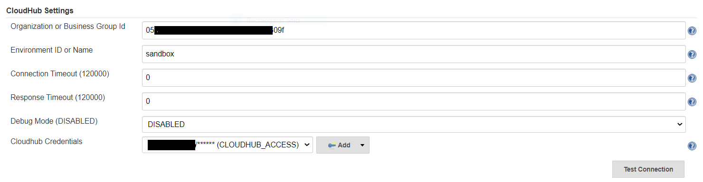
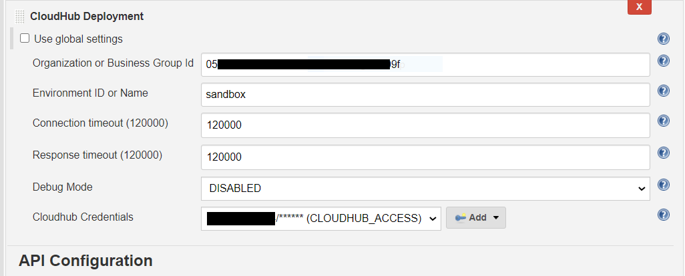

# Cloudhub Deployment Jenkins Plugin

This plugin adds Cloudhub deployment abilities to build steps.

This plugin allows you to create, update, restart and delete CloudHub applications.

Github link: https://github.com/vrnvikas/cloudhub-deployer-plugin

## Overview and Setting up

In order to understand how this plugin works, you need to understand how Cloudhub and Api Deployment in Cloudhub works.

After building and installing the plugin, some simple configuration need to done for your project.

**Freestyle**

1. Open up your project configuration
1. In the `Add Build Step` section, select "CloudHub Deployment"

    

1. Application Name, Request Mode, Environment ID, and CloudHub Credentials are all
required options. Other Option may or may not be needed based on Request Mode.
1. For few configurations, there are two options
  1. Set them at global plugin configuration level(go to Manage Jenkins -> Configure System -> CloudHub Settings).
  To use this option don't uncheck the "Use global settings" check box.
     
     
     
  1. Or Set them at the CloudHub Deployment build step configuration, Simply uncheck the "Use global settings" check box 
  and fill the field.
  
     
     
1. Fill all other field accordingly see help section if not sure.
   
     

**Pipeline**

You can also use this plugin in pipeline (Jenkinsfile). 

1.  Create a [Jenkins Pipeline](https://wiki.jenkins-ci.org/display/JENKINS/Pipeline+Plugin) project
1.  Use the Pipeline Snippet Generator
1.  For 'Sample Step', choose 'step: General Build Step'
1.  For 'Build Step', choose 'CloudHub Deployment'
1.  Populate variables as described above and then 'Generate Groovy'

Here are some samples to use the plugin in pipeline script:

1. Create API with all available options - 
        
        import org.jenkinsci.plugins.cloudhubdeployer.common.*;
        import org.jenkinsci.plugins.cloudhubdeployer.data.*;

        node{

            cloudhubDeployer(environmentId :'sandbox', orgId :'XXXXX-XXXX-XXX-XXXX-XXXX-XXXXXXXX', 
            requestMode : RequestMode.CREATE , appName :'some-application-name', credentialsId :'CLOUDHUB_ACCESS', 
            muleVersion :'4.3.0', region :'us-east-1', filePath :'target/*.jar', timeoutConnection : 30000, 
            timeoutResponse : 12000, debugMode : DebugMode.DISABLED, ignoreGlobalSettings : true, autoStart : true, 
            workerAmount : 1, workerType : 'Small', workerWeight : '0.2',workerCpu : '0.2', workerMemory : '1 GB', 
            monitoringEnabled : true, monitoringAutoRestart : true, loggingNgEnabled : true, persistentQueues : false, 
            persistentQueuesEncrypted : false, objectStoreV1 : false, envVars : [envVars(key : 'env' , value :  'dev')], 
            logLevels : [logLevels(levelCategory : LogLevelCategory.DEBUG ,packageName : 'some package name')], 
            enableAutoScalePolicy: true, autoScalePolicy: [AutoScalePolicy(autoScalePolicyName: 'sample_policy_name', 
            maxScale: 8, minScale: 1, scaleBasedOn: 'CPU', scaleDownNextScaleWaitMins: 31, scaleDownPeriodCount: 5, 
            scaleDownValue: 50, scaleType: 'WORKER_COUNT', scaleUpNextScaleWaitMins: 31, scaleUpPeriodCount: 5, 
            scaleUpValue: 80)], verifyDeployments : true, verifyIntervalInSeconds: 20000)
        
        }

1. Update API -

       cloudhubDeployer appName: 'some-application-name', filePath: 'target/*.jar', muleVersion: '4.3.0', 
       region: 'us-east-1', requestMode: RequestMode.UPDATE, workerMemory: '1 GB'
       
                                                    OR
                                                    
       cloudhubDeployer appName: 'some-application-name', filePath: 'target/*.jar', muleVersion: '4.3.0', 
       region: 'us-east-1', requestMode: RequestMode.UPDATE, workerMemory: '1 GB', ignoreGlobalSettings : true,
       environmentId :'sandbox', orgId :'XXXXX-XXXX-XXX-XXXX-XXXX-XXXXXXXX', 
       credentialsId :'CLOUDHUB_ACCESS'
       
1. Update or create - 
        
        cloudhubDeployer appName: 'some-application-name', filePath: 'target/*.jar', muleVersion: '4.3.0', 
        region: 'us-east-1', requestMode: RequestMode.CREATE_OR_UPDATE, workerMemory: '1 GB'
        
                                                     OR
        
        cloudhubDeployer appName: 'some-application-name', filePath: 'target/*.jar', muleVersion: '4.3.0', 
        region: 'us-east-1', requestMode: RequestMode.CREATE_OR_UPDATE, workerMemory: '1 GB', ignoreGlobalSettings : true, 
        environmentId :'sandbox', orgId :'XXXXX-XXXX-XXX-XXXX-XXXX-XXXXXXXX', 
        credentialsId :'CLOUDHUB_ACCESS'
        
        
        
1. Update API only package -
        
        cloudhubDeployer appName: 'some-application-name', filePath: 'target/*.jar', requestMode: RequestMode.UPDATE_FILE
        
                                                     OR
                                                     
        cloudhubDeployer appName: 'some-application-name', filePath: 'target/*.jar', requestMode: RequestMode.UPDATE_FILE,
        ignoreGlobalSettings : true, environmentId :'sandbox', orgId :'XXXXX-XXXX-XXX-XXXX-XXXX-XXXXXXXX', 
        credentialsId :'CLOUDHUB_ACCESS'
        
1. Restart API -
        
        cloudhubDeployer appName: 'some-application-name', requestMode: RequestMode.RESTART
        
                                                     OR
        
        cloudhubDeployer appName: 'some-application-name', requestMode: RequestMode.RESTART, ignoreGlobalSettings : true, 
        environmentId :'sandbox', orgId :'XXXXX-XXXX-XXX-XXXX-XXXX-XXXXXXXX', 
        credentialsId :'CLOUDHUB_ACCESS'
        
1. Delete API -
        
        cloudhubDeployer appName: 'some-application-name', requestMode: RequestMode.DELETE
        
                                                     OR
        
        cloudhubDeployer appName: 'some-application-name', requestMode: RequestMode.DELETE, ignoreGlobalSettings : true, 
        environmentId :'sandbox', orgId :'XXXXX-XXXX-XXX-XXXX-XXXX-XXXXXXXX', 
        credentialsId :'CLOUDHUB_ACCESS'

## AutoScale Policy

To enable AutoScale Policy for application, Add below parameters to pipeline script with any of above shown request. If 
autosocale policy is not already present it will create one or update existing if any changes.

        enableAutoScalePolicy: true, autoScalePolicy: [AutoScalePolicy(autoScalePolicyName: 'sample_policy_name', 
        maxScale: 8, minScale: 1, scaleBasedOn: 'CPU', scaleDownNextScaleWaitMins: 31, scaleDownPeriodCount: 5, 
        scaleDownValue: 50, scaleType: 'WORKER_COUNT', scaleUpNextScaleWaitMins: 31, scaleUpPeriodCount: 5, 
        scaleUpValue: 80)]
        

## Configuration

The following table lists the configurable parameters for the plugin and their default values.

| Parameter                   |  Default                                                    |
| ----------------------------|  -----------------------------------------------------------|
| `environmentId`             |  `none`                                                     |
| `orgId`                     |  `none`                                                     |
| `requestMode`               |  `none`                                                     |
| `appName`                   |  `none`                                                     |
| `credentialsId`             |  `none`                                                     |
| `muleVersion`               |  `none`                                                     |
| `region`                    |  `none`                                                     |
| `filePath`                  |  `none`                                                     |
| `timeoutConnection`         |  `120000`                                                   |
| `timeoutResponse`           |  `120000`                                                   |
| `debugMode`                 |  `disabled`                                                 |
| `ignoreGlobalSettings`      |  `false`                                                    |
| `autoStart`                 |  `true`                                                     |
| `workerAmount`              |  `1`                                                        |
| `workerType`                |  `Small`                                                    |
| `workerWeight`              |  `0.2`                                                      |
| `workerCpu`                 |  `0.2`                                                      |
| `workerMemory`              |  `1 GB`                                                     |
| `monitoringEnabled`         |  `false`                                                    |
| `monitoringAutoRestart`     |  `false`                                                    |
| `loggingNgEnabled`          |  `false`                                                    |
| `persistentQueues`          |  `false`                                                    |
| `persistentQueuesEncrypted` |  `false`                                                    |
| `objectStoreV1`             |  `false`                                                    |
| `envVars`                   |  `[]`                                                       |
| `logLevels`                 |  `[]`                                                       |
| `verifyDeployments`         |  `true`                                                     |
| `verifyIntervalInSeconds`   |  `30000`                                                    |
| `enableAutoScalePolicy`     |  `false`                                                    |
| `autoScalePolicy`           |  `[]`                                                       |

## TODO LIST

  * Unit Tests
  * Add Support for Load balancer mapping
  * Add Support for API manger
        
License
-------

This plugin is licensed under MIT License. See the LICENSE file for more information.